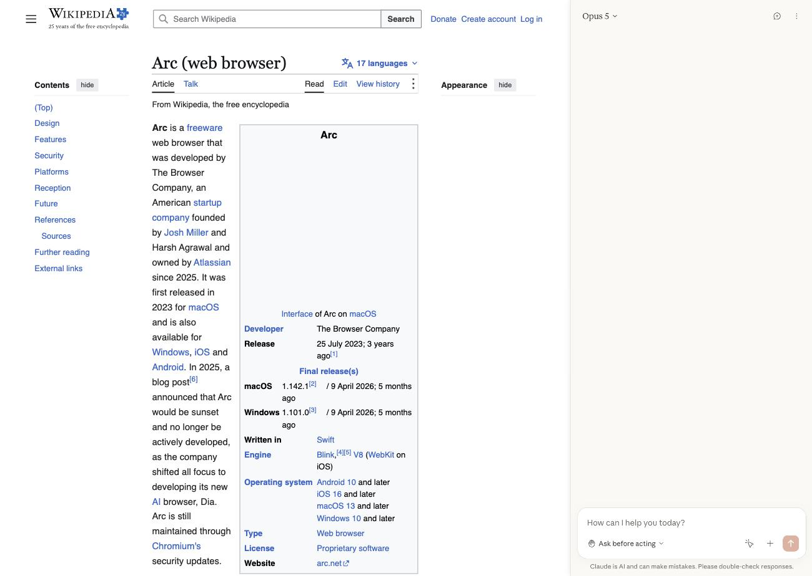

# Claude for Arc: Claude in Chrome for the Arc browser

Make the official **Claude in Chrome** extension work in the **Arc browser**: a working Claude side panel, and full browser control from **Claude Code** (click, type, fill forms, read pages, run JavaScript, take screenshots).

Out of the box, Claude in Chrome does not work in Arc. Arc has no side panel, so the panel never opens. Arc's tab groups API does not work either, and the extension builds every browser session on a tab group, so Claude Code's browser tools time out on the first call. This project adds a small compatibility layer on top of **your own installed copy** of the official extension and fixes both.



<sub>Screenshot: the Claude panel in Arc. Page content from Wikipedia, CC BY-SA 4.0.</sub>

## What works

| | Official extension in Arc | Claude for Arc |
|---|---|---|
| Side panel (Cmd+E / toolbar icon) | does not open | opens, docked to the right |
| Claude Code: tabs, navigate, form input | times out | works |
| Claude Code: click, type, key presses, screenshot | times out | works, in a separate Little Arc window |
| Claude Code: read_page, find, get_page_text, JavaScript | times out | works |
| Panel agent acting on the page | not available | works |

Tested on macOS with Arc 1.166.0 (Chromium 154) and Claude in Chrome 1.0.97.

## Install

You need [Node.js](https://nodejs.org) 18 or newer and Arc.

```bash
git clone https://github.com/dsbugaev/claude-for-arc.git
cd claude-for-arc
node patch.mjs
```

The script looks for the official extension installed in Chrome, Arc, Brave or Edge. If it finds none, it downloads the official build from the Chrome Web Store update server. It writes the patched extension to `dist/extension`.

Then in Arc:

1. Open `arc://extensions` and turn on **Developer mode**.
2. If the official **Claude** extension is installed in this Arc profile, remove it. Both use the same extension ID, so only one can be installed at a time.
3. Click **Load unpacked** and choose the `dist/extension` folder.
4. Press **Cmd+E** (Ctrl+E on Windows) or click the toolbar icon, and sign in with your Claude account.

To connect Claude Code, sign in to the panel with the same account you use in Claude Code, then run `/chrome` in Claude Code and pick **Reconnect extension**. If several browsers are connected, choose Arc under **Select browser**.

## Update

The patched extension does not update itself. After a new official version is released, rebuild it. The script takes the newest installed copy; add `--download` to fetch the latest build from Google instead.

```bash
git pull
node patch.mjs
```

Then click the reload arrow on **Claude for Arc** in `arc://extensions`.

## How it works

`patch.mjs` copies the official extension and adds files from `src/`. The official code is not modified. Only the manifest, the service worker loader and three extension pages get extra entries.

- **Tab groups** (`src/tabgroups.js`). Replaces `chrome.tabGroups`, `chrome.tabs.group` and `chrome.tabs.ungroup` with an emulation stored in `chrome.storage.session`. Tabs returned by `chrome.tabs.*` carry the emulated `groupId`. It is loaded before the official code in the service worker and in extension pages, so they share one view. Tabs Claude drives are not grouped visually in Arc.
- **Own window for Claude's tabs** (`src/tabgroups.js`). The official code opens the tabs Claude Code drives in the background of your window. Arc does not deliver mouse and key presses to a tab it is not showing, and cannot take a screenshot of it. So these tabs open in a separate Little Arc window instead, where the tab is always the visible one. Your own window, space and active tab are not touched.
- **Side panel** (`src/sidepanel.js`, `src/panel-injector.js`, `src/viewport-override.js`). Replaces `chrome.sidePanel`. Opening the panel shows the extension's `sidepanel.html` in an iframe docked to the right edge of the page, and the page is resized to make room. The panel runs in window mode, which uses the extension's built-in chat. The default panel embeds claude.ai, and claude.ai does not allow being embedded inside another site.

Browser control itself needed no changes. The official code uses `chrome.debugger` for clicks and typing, and it works in Arc once the tab is visible.

## Limitations

- The panel uses the extension's built-in chat, not the newer claude.ai-based panel.
- Each tab Claude Code opens appears as a separate Little Arc window and closes when Claude closes the tab. If you are in another application, opening such a window brings Arc to the front.
- Cmd+E is captured on web pages to toggle the panel.
- The panel cannot open on `arc://` pages, the Chrome Web Store, and tabs that were open before the extension was loaded (reload the tab).
- Tested on macOS only. Windows paths are supported by the script but not tested.

## Security

The patch adds no network requests and no remote code. Compared to the official extension, it adds two content scripts on all sites (the panel injector, and a small main-world script that narrows the reported viewport width while the panel is open) and makes `sidepanel.html` web-accessible (with `use_dynamic_url`) so the panel can load inside pages. All of it is in `src/`, a few hundred lines.

This repository does not contain Anthropic's code. The script patches the copy you install from the Chrome Web Store.

## FAQ

**Does Claude in Chrome work in Arc?**
Not out of the box: the side panel does not open and Claude Code's browser tools time out. With this patch both work.

**How do I use Claude Code with the Arc browser?**
Install Claude for Arc, sign in to the panel with your Claude Code account, then run `/chrome` in Claude Code and reconnect. Claude Code already detects Arc and sets up the connection.

**Why "Browser extension is not connected" or "tabs_context_mcp did not respond in time" in Arc?**
The first means the extension is not signed in with the same account as Claude Code, or needs a reconnect (`/chrome`). The second is the tab group problem this project fixes.

**Is this official?**
No. This is an unofficial community project, not affiliated with or endorsed by Anthropic or The Browser Company.

## Credits

The side panel injection (`panel-injector.js`, `viewport-override.js`, `cmd-e-fallback.js`) comes from [chxsong/Claude-in-Arc](https://github.com/chxsong/Claude-in-Arc) (MIT). That project ships a patched copy of an older extension version and handles Claude Code tools with its own limited replacements. Claude for Arc applies the fixes to the current official version instead.

## License

MIT. See [LICENSE](LICENSE).
